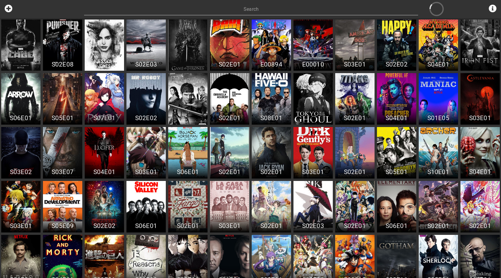
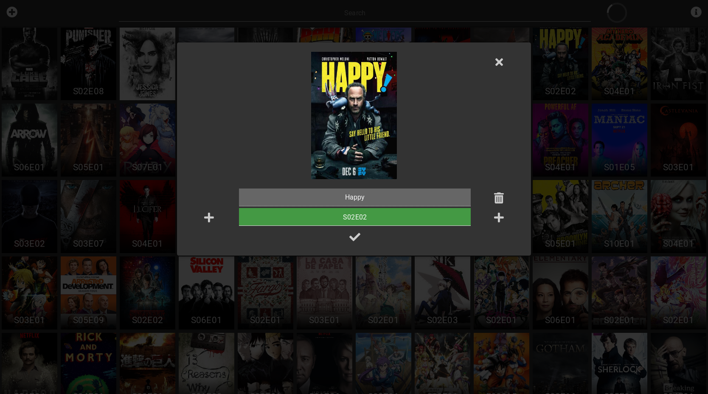

# Serien tracker

Since I may have a little problem with watching series, I created this project for keeping track of the (&gt; 150) series I watched or still watch.

I'm currently working on a version worth of releasing, but there is still a long way to go, see issues.

## Try it yourself

- Get yourself an [OMDB API Key](http://www.omdbapi.com/)
- Install [npm](https://www.npmjs.com/)
- Install [golang](https://golang.org/)
- `make install`
- `make build`
- `OMDB=api-key make run`
